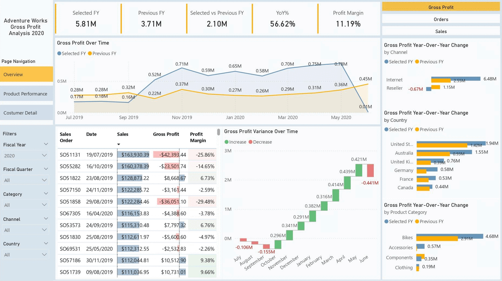
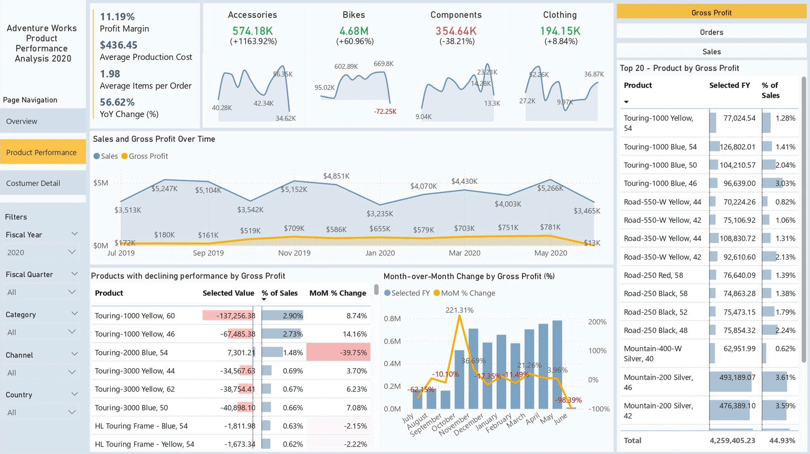

# Adventure Works Business Performance Report | Power Bi

## Overview

### Features
- Track key performance indicators (KPIs) for gross profit, sales, orders, and profit margin
- Compare sales, gross profit, and order volume across different sales channels, countries, and product categories
- Analyze country-wise and product-category-wise profit trends
- Identify high- and low-performing orders and time periods
- Display year-over-year (YoY) changes to track growth and performance trends over time

### Insights
- Top-performing countries in terms of gross profit growth include the United States and Australia
- Bikes were the leading product category, generating $4.68M in gross profit, significantly outperforming other categories
- Total gross profit for FY 2020 was $5.81M, a 56.62% increase YoY compared to $3.71M in FY 2019.
  This growth was largely driven by the Internet sales channel, which saw a $4.10M increase in gross profit YoY
- Order Growth: Orders surged to 23.52K in FY 2020, a 429.71% YoY increase from 4.44K showing more customers and higher sales activity
- Multiple orders have negative gross profit suggesting pricing errors or high costs that need review
  
## Product Performance

### Features 

- Monitor product-level KPIs: sales, gross profit, profit margin, production cost, and YoY change
- Break down performance by product category: Bikes, Accessories, Components, and Clothing
- Track month-over-month (MoM) changes to spot seasonal trends and anomalies
- Identify top-performing and underperforming products by gross profit, sales and order volume
- Visualize sales vs. gross profit trends over time
- Highlight products with declining performance
- Filter and drill-through capabilities to explore performance by time period, country, or sales channel

### Insights 

- Accessories saw the most significant growth (+1163.92% YoY in gross profit)and components experienced a steep decline (-38.21%)
- Products in the Touring-1000 and 3000 series showed negative profitability despite contributing to significant sales volume indicating pricing or cost issues
- Despite positive sales trends, some products show negative gross profit trends, which require immediate review to prevent margin erosion
- Several low-demand SKUs, like certain HL Touring Frame versions, deliver minimal sales and reduce profits, making them candidates for discontinuation

## Customer Detail

### Features

- Track customer-level KPIs: revenue, profit, order value, and repeat behavior
- Segment customers by value tier (Low, Medium, High) and purchase type (One-Time vs. Repeat) to compare performance, retention, and profitability
- Analyze churn rate, repeat purchase rate, and customer lifetime value trends over time
- Identify and profile top customers, including their spend patterns and order frequency
- Visualize cumulative and monthly customer growth across the fiscal period

### Insights
- Majority of customers are low-value and one-time buyers. Repeat buyers tend to spend more per purchase. Focus on converting them to repeat buyers with loyalty programs or personalized offers
- Revenue per customer is relatively high ($2,945), but gross profit per customer is low ($329.69), meaning margins are thin (11.19%) which imply high cost of goods sold (COGS)
- Monthly unique customers hover around 1.5–2.2k, with a cumulative total of about 20k by June—suggesting retention is steady
- Cumulative Customers consistently increased, indicating steady acquisition
- Total Customers show some fluctuation, possibly due to churn and seasonal changes
